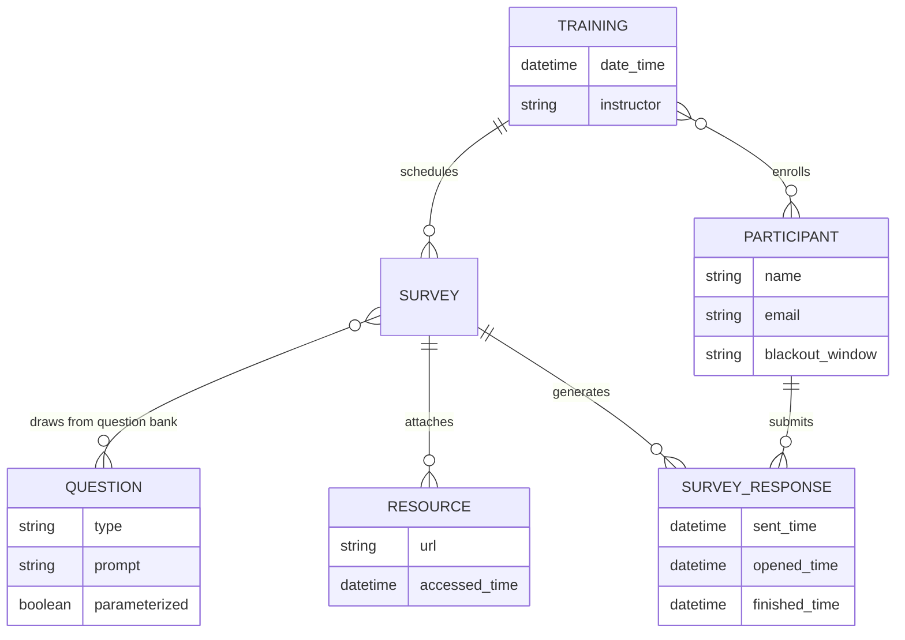
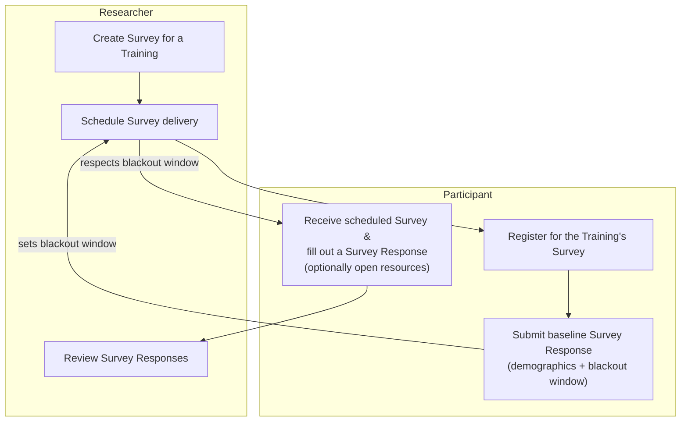

# Pilot Training Research App

A pilot platform for surveying training participants over time — to see whether the surveys themselves help people retain what they learned, and to give trainers and researchers a feedback loop they don't currently have.

## Goals

1. **Prove the platform is feasible** as a way to collect data from participants about trainings and continuous improvement.
   - Survey response-time data (compliance / missingness) informs the feasibility case.
   - A baseline survey and a post-pilot survey collect qualitative data on participant satisfaction.
2. Give trainers feedback on how to improve their trainings, based on participant responses over time.
3. Give the researcher data on how participants apply training content over time, and how that affects their outcomes.
4. Determine whether participating in the survey itself improves participant content retention.

## Personas

| Persona | Wants |
|---|---|
| **Researcher** | To prove methodologies that make training more effective |
| **Participant** | To improve the training programs they take part in |
| **Trainer** | To know how their training is landing, and track improvement over time |

## Use cases

### MVP

**Researcher creates a Survey** · *Researcher*
Multiple surveys for one Training can be authored over time and scheduled ahead of time.

**Researcher schedules Survey delivery** · *Researcher*
Each survey sends on a specific day, outside the participant's blackout window, and may carry its own set of Questions.

**Participant registers for a Training's Survey** · *Researcher, Participant*
The registration link is bound to a Training the Researcher has already set up.

**Participant submits a baseline Survey response** · *Participant*
Captures demographics and the participant's blackout window (when not to send prompts). One baseline applies across all Trainings, and it doubles as input to Goal 1's feasibility analysis.

**Participant fills out a Survey** · *Participant*
Opens the survey, answers its Questions, completes it — and can open linked resources (training materials) from inside the survey.

**Researcher reviews Survey results** · *Researcher*
Reviews aggregated participant responses for a survey.

### Next

- **Participant reviews their own Survey responses.**
- **Trainers get feedback faster** — a Trainer registers, then views survey data and response patterns aggregated across the participants of a Training they conducted.

## Entities

**Training** — date/time · instructor · participants · surveys

**Survey** — 9–10 questions · additional resources (links to training materials)

**Survey Response** — a Participant's fulfilled Survey · sent time · opened time · finished time · answers · resource-accessed time(s)

**Question** — type: Likert, text input, matching?, choice · may be free-floating and assigned to surveys to speed up authoring · may be parameterized (e.g. *"I feel confident using \<skill\>"*)

**Participant** — name · email · blackout window (when notifications should *not* be sent)

## Relationships

## MVP workflow

Baseline collection and delivery scheduling are the same loop: the participant's blackout window, captured once at baseline, constrains every survey the researcher schedules afterward.

