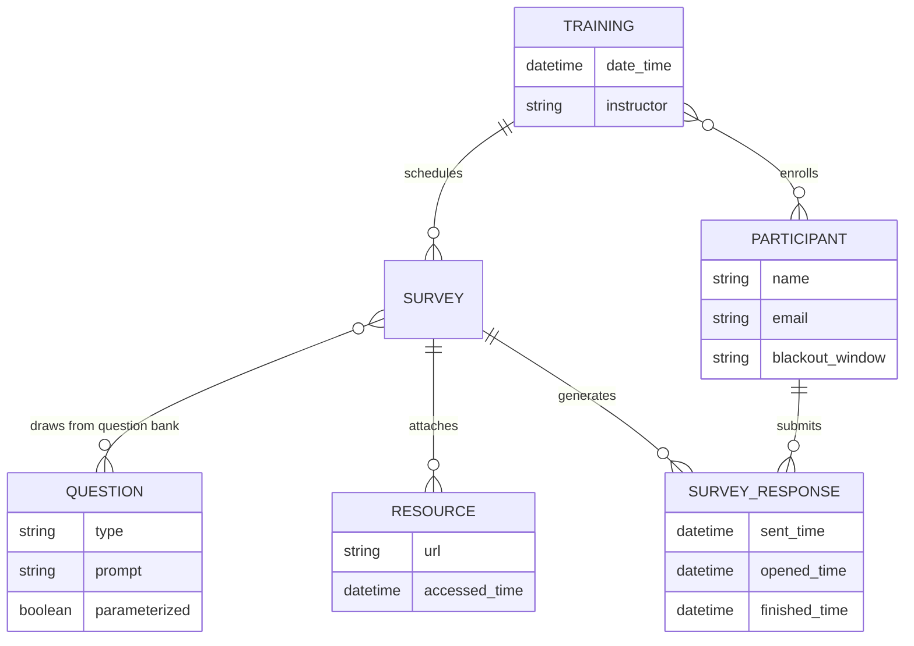
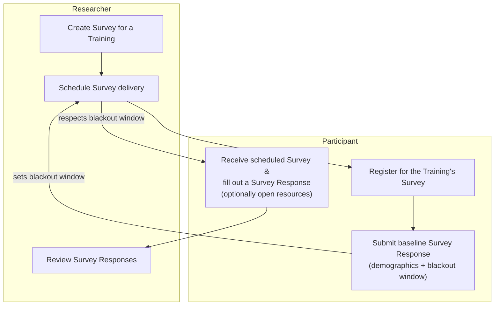
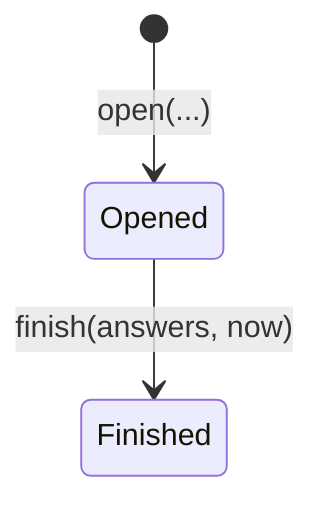

# Pilot Training Research App

A pilot platform for surveying training participants over time — to see whether the surveys themselves help people retain what they learned, and to give trainers and researchers a feedback loop they don't currently have.

## Goals

1. **Prove the platform is feasible** as a way to collect data from participants about trainings and continuous improvement.
   - Survey response-time data (compliance / missingness) informs the feasibility case.
   - A baseline survey and a post-pilot survey collect qualitative data on participant satisfaction.
2. Give trainers feedback on how to improve their trainings, based on participant responses over time.
3. Give the researcher data on how participants apply training content over time, and how that affects their outcomes.
4. Determine whether participating in the survey itself improves participant content retention.

## Personas

| Persona | Wants |
|---|---|
| **Researcher** | To prove methodologies that make training more effective |
| **Participant** | To improve the training programs they take part in |
| **Trainer** | To know how their training is landing, and track improvement over time |

## Use cases

### MVP

**Researcher creates a Survey** · *Researcher*
Multiple surveys for one Training can be authored over time and scheduled ahead of time.

**Researcher schedules Survey delivery** · *Researcher*
Each survey sends on a specific day, outside the participant's blackout window, and may carry its own set of Questions.

**Participant registers for a Training's Survey** · *Researcher, Participant*
The registration link is bound to a Training the Researcher has already set up.

**Participant submits a baseline Survey response** · *Participant*
Captures demographics and the participant's blackout window (when not to send prompts). One baseline applies across all Trainings, and it doubles as input to Goal 1's feasibility analysis.

**Participant fills out a Survey** · *Participant*
Opens the survey, answers its Questions, completes it — and can open linked resources (training materials) from inside the survey.

**Researcher reviews Survey results** · *Researcher*
Reviews aggregated participant responses for a survey.

### Next

- **Participant reviews their own Survey responses.**
- **Trainers get feedback faster** — a Trainer registers, then views survey data and response patterns aggregated across the participants of a Training they conducted.

## Entities

**Training** — date/time · instructor · participants · surveys

**Survey** — 9–10 questions · additional resources (links to training materials)

**Survey Response** — a Participant's fulfilled Survey · sent time · opened time · finished time · answers · resource-accessed time(s)

**Question** — type: Likert, text input, matching?, choice · may be free-floating and assigned to surveys to speed up authoring · may be parameterized (e.g. *"I feel confident using \<skill\>"*)

**Participant** — name · email · blackout window (when notifications should *not* be sent)

## Relationships



## MVP workflow

Baseline collection and delivery scheduling are the same loop: the participant's blackout window, captured once at baseline, constrains every survey the researcher schedules afterward.



## Question — implemented slice

The rest of this Core Domain (Training / Survey / Participant / Survey
Response) isn't built yet. `Question` is the first piece: a researcher can
author a free-floating Question — independent of any Survey — that gets
assigned to Surveys later, once Survey exists. This section documents that
slice to the same standard [`notification-delivery-model.md`](notification-delivery-model.md)
uses, per [`architecture.md`](architecture.md)'s per-context doc template;
the rest of this document stays as the higher-level vision/use-case sketch
for the whole Core Domain.

### Ubiquitous language — Question

| Term | Meaning in this context |
|---|---|
| **Question** (aggregate root) | A prompt plus an author-defined `AnswerFormat`, authored independently of any Survey ("free-floating") so it can be reused across many. Carries no notion of a correct answer — Survey Responses are never scored. |
| **AnswerFormat** | The closed shape of answers a Question accepts: `FreeInput`, `Likert`, or `Choice`. |
| **Likert scale** | An author-configurable, ordered list of scale-point labels (e.g. Strongly Disagree → Strongly Agree) attached to a Likert Question — count and labels are both chosen per Question, not fixed. |
| **Choice options** | An author-configurable list of answer options attached to a Choice Question, plus an `allowMultiple` flag the researcher sets per Question (single-select vs. multi-select). |
| **Parameter** | A named placeholder (`<skill>`) embedded in a Question's `prompt`. A Question may declare zero or more Parameters, one per distinct placeholder; each is bound to a value when the Question is instantiated into a Survey. |

Explicitly rejected terms:

- **Matching** (question type) — present with a "?" in the Entities sketch
  above; dropped for this pass since no concrete use case has specified its
  shape yet. Add it back only when a real matching-question need appears,
  same discipline `notification-delivery-model.md` applies to its own
  rejected terms.
- **Correct answer / score** — Questions and their answers carry no notion
  of correctness; explicitly out of scope per the researcher's brief that
  started this slice.

### Entities & Aggregates — Question

#### `Question` (aggregate root)

- `id`
- `prompt` — may contain zero or more `<name>` parameter placeholders
- `answerFormat` — one of:
  - `FreeInput` — no additional data
  - `Likert` — `scale`: ordered list of point labels (≥ 2), configured per Question
  - `Choice` — `options`: list of option labels (≥ 2, unique), `allowMultiple`: chosen per Question

Behavior:
- `parameterNames` — derived from `prompt` (never stored separately, so
  there's nothing to keep in sync): the ordered, deduplicated list of
  `<name>` tokens found in it.
- `isParameterized` — `parameterNames.length > 0`.
- `renderPrompt(parameterValues)` — substitutes every `<name>` with its
  bound value; throws (`MISSING_PARAMETER_VALUES` / `UNEXPECTED_PARAMETER_VALUES`)
  if the given values don't exactly match the declared parameters. This is
  the behavior the Survey side of "instantiated into a Survey" will call
  once Survey exists — `Question` itself never learns about Survey.

### Target layering — Question

Implemented as TypeScript compiled via `tsc` and run as NestJS (see
[`architecture.md`](architecture.md)), following the same layering
[`notification-delivery-model.md`](notification-delivery-model.md) uses:

```
domain/src/training/          # shared package — see architecture.md's "The domain/ package"
  question.ts               # entity: create/parameterNames/isParameterized/renderPrompt
  answer-format.ts           # value object: FreeInput | Likert | Choice, factory functions validate invariants
  index.ts                   # barrel, exported as 'domain/training'

backend/training/
  application/
    ports.ts                    # QuestionRepository (interface) + its DI token, GENERATE_ID
    errors.ts                   # TrainingError — this context's coded-error shape
    create-question.ts          # CreateQuestion
    get-question.ts             # GetQuestion — 404 (NOT_FOUND) if unknown
    list-questions.ts           # ListQuestions
  infrastructure/
    sqlite-question-repository.ts   # @Injectable(); implements QuestionRepository; owns the questions table
  interface/
    questions.controller.ts         # @Controller('api') — create, list, get; gated by identity's guards
    question-presenter.ts           # pure: domain Question -> wire QuestionView
    training-exception.filter.ts    # @Catch() maps TrainingError.code -> HTTP status
  training.module.ts             # this context's slice of the composition root
```

This also has a frontend-side counterpart — ports, a store, an HTTP gateway,
and a create form/list under `frontend/src/app/training/` — documented in
[`docs/frontend-architecture.md`](frontend-architecture.md) rather than
here, same split `notification-delivery-model.md` uses.

### Relationship to the rest of the Core Domain

Not built yet, and nothing above anticipates its shape beyond what
`renderPrompt` already supports:

- Survey will assign existing Questions to itself (draws from the question
  bank) and, for parameterized Questions, supply the parameter values
  `renderPrompt` needs. That assignment/binding is Survey's concern, not
  Question's — Question's model does not change to accommodate it.
- Question is authored by a Researcher only; gated the same way
  `notifications.controller.ts` gates its Researcher/Trainer-only routes
  (see [`docs/identity-model.md`](identity-model.md)'s "Gating a route").

### Non-goals (for now)

- Survey, Training, Participant, Survey Response, Resource — not modeled
  yet; this slice only builds the free-floating Question entity and its own
  authoring/read flow.
- Assigning a Question to a Survey, and binding its parameter values there —
  deferred until Survey exists.
- Editing/deleting/versioning a Question already in use by a Survey —
  deferred; only creation and read access are in scope now.
- Matching-type Questions (see rejected terms above).

## Training — implemented slice

`Training` is the next piece of this Core Domain — the aggregate Survey will
bind to (one Training → many Surveys) once Survey exists. Built by mirroring
`Question`'s file-for-file structure, and documented here to the same
standard, per [`architecture.md`](architecture.md)'s per-context doc
template.

### Ubiquitous language — Training

| Term | Meaning in this context |
|---|---|
| **Training** (aggregate root) | A scheduled training session: a `title`, an optional `description`, a `dateTime`, and the `Trainer` conducting it — this context's own `Trainer` aggregate (see "Trainer — implemented slice" below), referenced by id rather than embedded. |

Explicitly rejected terms:

- **`instructor`** (free-text name) — present as `string instructor` in the
  Entities sketch above; superseded by referencing a `Trainer` by id instead
  of duplicating a name string, matching [`identity-model.md`](identity-model.md)'s
  non-duplication stance on the future Participant/User relationship (a
  `Participant` will likewise reference a `User` by id rather than
  re-storing its own name/email). `trainerId` originally referenced
  Identity's `User(role: Trainer)`; it now references this context's own
  `Trainer` aggregate instead (see "Trainer — implemented slice" below),
  because Identity's account model only supports self-registration
  ([`identity-model.md`](identity-model.md)'s "no admin-driven invites or
  account creation" non-goal), and Training assignment needs to work without
  provisioning a login account for every trainer. Identity's `Trainer` role
  and self-registration path are untouched — they remain for the separate,
  still-unbuilt "Next" use case above (a Trainer registers, then views
  survey data...); this change only stops *Training assignment* from
  depending on it.

### Entities & Aggregates — Training

#### `Training` (aggregate root)

- `id`
- `title` — required
- `description` — optional
- `dateTime` — the session's single scheduled date/time
- `trainerId` — reference to a `Trainer` by id, not embedded

Behavior:
- `schedule({id, title, description, dateTime, trainerId})` — the only
  creation path. Validates `id` present, `title` present, `dateTime` a valid
  `Date`, `trainerId` present; throws a plain `Error` otherwise.
  `description` is optional with no validation beyond that. No mutation
  methods — nothing in scope needs them yet, same discipline `Question`
  follows.

### Target layering — Training

Implemented as TypeScript compiled via `tsc` and run as NestJS (see
[`architecture.md`](architecture.md)), following the same layering
`Question` above uses:

```
domain/src/training/
  training.ts                  # entity: Training.schedule(...), no mutation methods
  training.test.ts             # unit tests for Training.schedule's validation
  index.ts                     # barrel — adds `export * from '#training/training'`
                                # alongside Question's existing exports

backend/training/
  application/
    ports.ts                    # + TRAINING_REPOSITORY (DI token) + TrainingRepository
                                 # interface, alongside the existing QuestionRepository
    create-training.ts          # CreateTraining
    get-training.ts             # GetTraining — 404 (NOT_FOUND) if unknown
    list-trainings.ts           # ListTrainings
  infrastructure/
    sqlite-training-repository.ts   # @Injectable(); implements TrainingRepository; owns
                                     # the trainings table
  interface/
    trainings.controller.ts         # @Controller('api') — create, list, get;
                                     # @Roles('Researcher'), same guards/filter Question's
                                     # controller uses (errors.ts and
                                     # training-exception.filter.ts are shared as-is, not
                                     # re-created)
    training-presenter.ts           # pure: domain Training -> wire TrainingView
  training.module.ts             # extended: wires TrainingRepository/CreateTraining/
                                  # GetTraining/ListTrainings + TrainingsController
                                  # alongside the existing Question wiring
```

This also has a frontend-side counterpart — ports, a store, an HTTP gateway,
and a form/list under `frontend/src/app/training/` — documented in
[`docs/frontend-architecture.md`](frontend-architecture.md) rather than here,
same split `Question`'s slice above uses.

### Relationship to the rest of the Core Domain

Not built yet, and nothing above anticipates its shape beyond what
`trainerId` already supports:

- Survey will reference an existing Training by id once built (one Training
  → many Surveys, per the vision sketch above). That reference is Survey's
  concern, not Training's — Training's own model does not change to
  accommodate it.
- Training is authored by a Researcher only; gated the same way
  `questions.controller.ts` gates its Researcher-only routes (see
  [`docs/identity-model.md`](identity-model.md)'s "Gating a route").

### Non-goals (for now)

- Dates-as-a-list — this pass keeps the single `dateTime` field per the
  original ER sketch above (`TRAINING { datetime date_time }`); a Training
  spanning multiple session dates is deferred until a real use case asks
  for it.
- Participant/enrollment (`TRAINING }o--o{ PARTICIPANT : enrolls`) — built
  in "Enrollment & blackout window — implemented slice" below, but *without*
  a `Participant` aggregate (see that section's rejected-terms note).
- Survey binding — built in "Survey — implemented slice" below.
- `trainerId` existence validation — no server-side check that the
  referenced `Trainer` id actually exists; the app trusts the UI's picker
  (which only ever offers Trainers created via the "Trainer — implemented
  slice" below), same lightweight-validation posture `Question` uses.

## Trainer — implemented slice

`Trainer` is a small aggregate added alongside `Training`, in the same
context — not a new bounded context — so a Researcher can assign a
`Training`'s `trainerId` to someone without that person holding an Identity
account. It replaces Identity's `User(role: Trainer)` as the reference
target of `Training.trainerId` (see that slice's "Explicitly rejected terms"
note above); Identity's `Trainer` role and self-registration path are
untouched, kept for the separate, still-unbuilt "Next" use case above (a
Trainer registers, then views survey data...). Built by mirroring
`Question`'s file-for-file structure — single required field,
researcher-authored, no update/delete — and documented here to the same
standard, per [`architecture.md`](architecture.md)'s per-context doc
template.

### Ubiquitous language — Trainer

| Term | Meaning in this context |
|---|---|
| **Trainer** (aggregate root) | The person conducting a `Training`, recorded as just a `name` — no account, no login, no email. Created by a Researcher so they can be assigned to a Training without self-registering an Identity account. |

Explicitly rejected terms:

- **Reusing Identity's `User(role: Trainer)` directly** — the original
  design (see Training's rejected-terms note above); rejected because it
  forces a login account for every trainer, and Identity's account model
  only supports self-registration, not admin-driven creation
  ([`identity-model.md`](identity-model.md)'s "no admin-driven invites or
  account creation" non-goal). This use case needs a Researcher to assign a
  trainer without provisioning an account, so it gets its own minimal
  aggregate instead.

### Entities & Aggregates — Trainer

#### `Trainer` (aggregate root)

- `id`
- `name` — required

Behavior:
- `create({id, name})` — the only creation path. Validates `id` present and
  `name` non-empty; throws a plain `Error` otherwise, same shape as
  `Question.create`. No mutation methods — nothing in scope needs them yet,
  same discipline `Question`/`Training` follow.

### Target layering — Trainer

```
domain/src/training/
  trainer.ts                   # entity: Trainer.create({id, name}), no mutation methods
  trainer.test.ts               # unit tests for Trainer.create's validation
  index.ts                      # barrel — adds `export * from '#training/trainer'`
                                 # alongside Question/Training's existing exports

backend/training/
  application/
    ports.ts                    # + TRAINER_REPOSITORY (DI token) + TrainerRepository
                                 # interface (findById, findAll, save), alongside the
                                 # existing QuestionRepository/TrainingRepository
    create-trainer.ts           # CreateTrainer
    get-trainer.ts               # GetTrainer — 404 (NOT_FOUND) if unknown; kept for
                                  # parity with Question/Training's own get-by-id use
                                  # case, even though the UI only needs create+list
    list-trainers.ts             # ListTrainers
  infrastructure/
    sqlite-trainer-repository.ts   # @Injectable(); implements TrainerRepository; owns
                                    # the trainers table
  interface/
    trainers.controller.ts         # @Controller('api') — create, list, get;
                                    # @Roles('Researcher'), same guards/filter Question's
                                    # controller uses (errors.ts and
                                    # training-exception.filter.ts are shared as-is, not
                                    # re-created)
    trainer-presenter.ts           # pure: domain Trainer -> wire TrainerView
  training.module.ts             # extended: wires TrainerRepository/CreateTrainer/
                                  # GetTrainer/ListTrainers + TrainersController
                                  # alongside the existing Question/Training wiring
```

This also has a frontend-side counterpart — ports, a store, an HTTP
gateway, and a form/list under `frontend/src/app/training/` — documented in
[`docs/frontend-architecture.md`](frontend-architecture.md) rather than
here, same split `Question`/`Training`'s slices above use.

### Relationship to the rest of the Core Domain

- `Training.trainerId` references a `Trainer` by id (see Training's
  rejected-terms note above) — that reference is `Training`'s concern, not
  `Trainer`'s; `Trainer` never learns about `Training`.
- `Trainer` is authored by a Researcher only; gated the same way
  `questions.controller.ts`/`trainings.controller.ts` gate their
  Researcher-only routes (see [`docs/identity-model.md`](identity-model.md)'s
  "Gating a route").

### Non-goals (for now)

- Editing/deleting a `Trainer` — only creation and read access are in scope
  now, same posture `Question`'s slice took.
- De-duplication of names — nothing checks for or prevents two Trainers
  with the same `name`.
- Linking a `Trainer` back to an Identity account — deferred until the
  "Next" self-registering-Trainer use case (a Trainer registers, then views
  survey data...) is actually built; this slice's `Trainer` has no
  relationship to Identity's `User` at all.

## Enrollment & blackout window — implemented slice

The next piece of this Core Domain — `TRAINING }o--o{ PARTICIPANT : enrolls`
from the vision sketch above, plus the blackout window the MVP workflow
diagram captures at baseline. Documented here to the same standard, per
[`architecture.md`](architecture.md)'s per-context doc template.

### Ubiquitous language — Enrollment & blackout window

| Term | Meaning in this context |
|---|---|
| **Enrollment** | The fact that a `User(role: Participant)` is registered for a `Training`'s surveys — a plain `userId` × `trainingId` association with no attributes of its own, matching the ER sketch's bare `}o--o{`. |
| **Blackout window** | One `{dayOfWeek, startTime, endTime}` range during which that person should not be sent survey prompts. A person's full set is a list of these — any number of ranges, spread across any days, including several on the same day. |

Explicitly rejected terms:

- **`Participant`** (as an aggregate/entity with its own id) — drafted, then
  dropped after two rounds of correction: *"a participant is just a kind of
  user, not a[n] [separate] identity"*, then *"blackout window and
  enrollment can relate to users and training but need not be inherent in
  their definition."* A `Participant` wrapper would have had no behavior or
  invariant of its own beyond a `userId` lookup — the tell that the
  aggregate boundary was wrong. Enrollment and blackout window are instead
  two independent, plain, repository-backed relations, each keyed directly
  by the Identity context's `User.id` — no second generated id anywhere in
  this slice.
- **A single daily blackout window** — considered (the first draft), then
  dropped: a real person needs different ranges on different days, e.g.
  "Monday 6:00–7:00am and 7:00–8:00pm, but Friday until 7:00am and 9:00pm."
  `BlackoutWindow` models one range; a person has a list of them.

### Entities & Aggregates — Enrollment & blackout window

No new aggregate root — both concepts are plain relations, not entities:

- **Enrollment** — persisted as a `trainingId`/`userId` row; enrolling is
  idempotent (enrolling twice in the same `Training` is a no-op, not an
  error).
- **`BlackoutWindow`** (value object) — `dayOfWeek` (one of `Sunday`
  .. `Saturday`), `startTime`/`endTime` (`"HH:mm"`). Factory
  `BlackoutWindow.between({dayOfWeek, startTime, endTime})` validates
  `dayOfWeek` membership, the `"HH:mm"` shape of both times, and that they
  differ. A person's blackout windows are stored as a plain `BlackoutWindow[]`
  — empty means no restriction — replaced as a whole list on save; there is
  no incremental add/remove operation yet.

### Target layering — Enrollment & blackout window

```
domain/src/training/
  blackout-window.ts           # value object: DAYS_OF_WEEK, BlackoutWindow.between(...)
  blackout-window.test.ts      # unit tests for the validation above
  index.ts                     # barrel — adds `export * from '#training/blackout-window'`

backend/training/
  application/
    ports.ts                    # + TRAINING_ENROLLMENT_REPOSITORY/TrainingEnrollmentRepository
                                 # (enroll, findTrainingIdsByUser, findUserIdsByTraining) and
                                 # BLACKOUT_WINDOW_REPOSITORY/BlackoutWindowRepository
                                 # (findByUserId, save — whole-list replace)
    enroll-in-training.ts       # EnrollInTraining — 404 if the Training is unknown, then enrolls
    get-my-enrollment.ts        # GetMyEnrollment — {trainingIds, blackoutWindows} combined read
  infrastructure/
    sqlite-training-enrollment-repository.ts   # @Injectable(); owns the training_participants table
    sqlite-blackout-window-repository.ts       # @Injectable(); owns the blackout_windows table;
                                                # save() deletes + re-inserts a user's rows in one
                                                # transaction
  interface/
    enrollment.controller.ts    # @Controller('api') — POST /enrollments (@Roles('Participant'),
                                 # userId always taken from the session, never the request body),
                                 # GET /enrollments/me (any authenticated role)
  training.module.ts             # extended: wires both repositories + both use cases +
                                  # EnrollmentController
```

`trainings.controller.ts` changed alongside this slice: `@Roles('Researcher')`
moved from the controller class down to just the `create` method, so
`list`/`byId` are reachable by any authenticated role — a Participant needs
to browse Trainings in order to enroll in one.

This also has a frontend-side counterpart — `EnrollmentGateway`,
`EnrollmentStore`, an HTTP gateway, and a client-area registration page under
`frontend/src/app/training/` and `frontend/src/app/shell/client/` —
documented in [`docs/frontend-architecture.md`](frontend-architecture.md)
rather than here.

### Relationship to the rest of the Core Domain

- `Survey` (below) references the enrolled person only indirectly, through
  `SurveyResponse.userId` — enrollment itself is not a precondition
  `SurveyResponse` checks (see that section's non-goals).
- Enrollment and blackout window both reference Identity's `User` by id,
  never duplicating email/credentials — same non-duplication stance
  [`identity-model.md`](identity-model.md) already states for this
  relationship.

### Non-goals (for now)

- Baseline Survey Response (demographics + blackout-window capture via a
  real survey submission) — the doc names it but never defines a
  demographics schema; inventing one would violate this project's
  keep-the-language-minimal discipline. This slice makes
  `BlackoutWindowRepository.save()` ready for a future baseline flow to call,
  but doesn't build that flow.
- Enrollment is not enforced as a precondition anywhere yet (e.g.
  `OpenSurveyResponse` doesn't check it) — deferred until a real use case
  needs it.
- No incremental add/remove of a single blackout window — `save()` always
  replaces the full list.
- Day-of-week blackout enforcement against an actual Survey's `sendDate`/
  send time — this slice only stores the data; nothing yet reads it when
  scheduling delivery (that's notification-delivery integration, still
  future work per [`notification-delivery-model.md`](notification-delivery-model.md)'s
  own "Relationship to the future Core Domain" section).

## Survey — implemented slice

The next piece of this Core Domain after Question/Training/Enrollment: the
aggregate a Training's surveys are scheduled as, drawing Questions from the
free-floating bank and carrying links to training materials. Documented here
to the same standard.

### Ubiquitous language — Survey

| Term | Meaning in this context |
|---|---|
| **Survey** (aggregate root) | A scheduled set of Questions for one `Training`, authored and scheduled in a single step, sent on a specific `sendDate`. |
| **SurveyQuestion** | The binding of an existing `Question` (by id) into a `Survey`, plus the parameter values that `Question`'s `renderPrompt` needs if it's parameterized. Order in the list is the order the Survey presents them. |
| **Resource** | A link to training material attached to a `Survey` — just `{id, url}`. The `id` exists so a `SurveyResponse` can later record *which* resource was accessed; `Resource` has no lifecycle of its own apart from the `Survey` that attaches it. |

Explicitly rejected terms:

- **`Resource.accessedTime`** — present on the ER sketch's `RESOURCE` box,
  but that conflates two different moments: the link itself (authored once,
  on the `Survey`) and *someone opening it* (an event that happens per
  `SurveyResponse`, possibly many times, by many different people). Kept off
  `Resource`; access events live on `SurveyResponse.resourceAccesses`
  instead (see below).
- **A separate "schedule" step** — the vision sketch's "Researcher creates a
  Survey" and "Researcher schedules Survey delivery" use cases are one
  `CreateSurvey` call here, matching `CreateQuestion`/`CreateTraining`'s
  single-creation-path precedent; there is no draft/unscheduled state.

### Entities & Aggregates — Survey

#### `Survey` (aggregate root)

- `id`
- `trainingId` — reference to a `Training` by id
- `sendDate` — the day this Survey is scheduled to send
- `questions` — ordered `SurveyQuestion[]` (`{questionId, parameterValues}`)
- `resources` — `Resource[]` (`{id, url}`)

Behavior:
- `schedule({id, trainingId, sendDate})` — the only creation path. Validates
  `id`/`trainingId` present and `sendDate` a valid `Date` (no past-date
  guard, matching `Training.schedule`'s precedent, not `Notification`'s).
  `questions`/`resources` start empty.
- `assignQuestion({questionId, parameterValues})` — appends a
  `SurveyQuestion`. Validates `questionId` present; does not itself validate
  `parameterValues` against the referenced `Question`'s declared parameters
  — that cross-aggregate check is `CreateSurvey`'s job (below), via
  `Question.renderPrompt`.
- `attachResource({id, url})` — appends a `Resource`; validates a non-empty
  `url`.

### Target layering — Survey

```
domain/src/training/
  survey.ts                    # entity: Survey.schedule/assignQuestion/attachResource,
                                # plus the SurveyQuestion/Resource shapes (small enough to live
                                # in the same file, unlike AnswerFormat's 3-variant union)
  survey.test.ts                # unit tests for the validation/behavior above
  index.ts                      # barrel — adds `export * from '#training/survey'`

backend/training/
  application/
    ports.ts                    # + SURVEY_REPOSITORY/SurveyRepository (findById, findAll, save)
    create-survey.ts            # CreateSurvey — 404 if the Training is unknown; for each
                                 # question assignment, loads the Question (404 if unknown) and
                                 # calls renderPrompt purely to validate the parameter binding
                                 # (surfaces MISSING_PARAMETER_VALUES/UNEXPECTED_PARAMETER_VALUES)
                                 # before assignQuestion; generates a fresh id per resource
    get-survey.ts                # GetSurvey — 404 if unknown
    list-surveys.ts              # ListSurveys
  infrastructure/
    sqlite-survey-repository.ts  # @Injectable(); owns the surveys table; questions/resources
                                  # are JSON-serialized columns, same convention
                                  # sqlite-question-repository.ts uses for answerFormat
  interface/
    surveys.controller.ts        # @Controller('api') — create (@Roles('Researcher') only),
                                  # list/byId (any authenticated role — a Participant needs to
                                  # read a Survey's questions to fill it out)
    survey-presenter.ts          # pure: domain Survey -> wire SurveyView
  training.module.ts             # extended: wires SurveyRepository/CreateSurvey/GetSurvey/
                                  # ListSurveys + SurveysController
```

`training-exception.filter.ts` gained two entries in `ERROR_STATUS_BY_CODE`
alongside this slice: `MISSING_PARAMETER_VALUES: 400` and
`UNEXPECTED_PARAMETER_VALUES: 400` — the codes `Question.renderPrompt`
already threw, now mapped instead of falling through to an incorrectly
logged 500.

This also has a frontend-side counterpart — `SurveyGateway`, `SurveysStore`,
an HTTP gateway, and an authoring form/list under
`frontend/src/app/training/` and `frontend/src/app/shell/admin/` —
documented in [`docs/frontend-architecture.md`](frontend-architecture.md)
rather than here.

### Relationship to the rest of the Core Domain

- `SurveyResponse` (below) references an existing `Survey` by id and reads
  its `questions`/`resources` to render the fill-out form — that's
  `SurveyResponse`'s concern, not `Survey`'s; `Survey`'s own model does not
  change to accommodate it.
- `Survey` never learns about Enrollment or blackout windows — respecting a
  Participant's blackout window when actually delivering a Survey is
  deferred (see Enrollment's non-goals above).

### Non-goals (for now)

- Editing/deleting a `Survey` once created, or re-ordering/removing an
  already-assigned `SurveyQuestion`/`Resource` — only creation and read
  access are in scope now, same posture `Question`'s slice took.
  `assignQuestion`/`attachResource` are only ever called during `CreateSurvey`.
- `sendDate` enforcement — nothing yet triggers delivery on that date, or
  checks it against any Participant's blackout window; that's
  notification-delivery integration, still future work.
- Draft/unscheduled Surveys — every `Survey` is scheduled at creation (see
  rejected terms above).

## Survey Response — implemented slice

The last piece of this pass: a Participant's fulfillment of a `Survey` —
opening it, answering its Questions, optionally opening its Resources, and
submitting. The first entity in this Core Domain with a real state machine.

### Ubiquitous language — Survey Response

| Term | Meaning in this context |
|---|---|
| **Survey Response** (aggregate root) | One `User(role: Participant)`'s fulfillment of one `Survey` — its open/finish timestamps, answers, and resource-access events. |
| **Answer** | One `{questionId, value}` pair, where `value` is a `string` (free text, or a single selection) or `string[]` (a multi-select `Choice` answer). |
| **Resource access** | A `{resourceId, accessedTime}` event — recorded each time the Participant opens one of the Survey's attached Resources from inside the response. |

Explicitly rejected terms:

- **`sentTime`** — present on the ER sketch's `SURVEY_RESPONSE` box, but
  nothing in this context automates sending yet (that needs
  notification-delivery integration, per that context's own
  "Relationship to the future Core Domain" section, still unbuilt). Rather
  than add a field nothing ever sets, it's left off entirely — same
  discipline `Question`'s slice used to defer "Matching" — until that
  integration exists to populate it.
- **`participantId`** — there is no `Participant` aggregate (see
  Enrollment's rejected terms above); `SurveyResponse` references the
  person by `userId` directly, same as Enrollment does.

### Entities & Aggregates — Survey Response

#### `SurveyResponse` (aggregate root)

- `id`
- `surveyId` — reference to a `Survey` by id
- `userId` — reference to a `User` by id, not embedded
- `status` — `Opened | Finished`
- `openedTime`
- `finishedTime` — `null` until finished
- `answers` — `Answer[]`, empty until finished
- `resourceAccesses` — `ResourceAccess[]`

Behavior:
- `open({id, surveyId, userId, now})` — the only creation path; status
  starts `Opened`, `openedTime = now`, everything else empty/`null`.
- `accessResource(resourceId, now)` — appends a `ResourceAccess`; allowed in
  *any* status, since a Participant may revisit a resource link after
  finishing.
- `finish(answers, now)` — sets `answers`/`finishedTime`, moves status to
  `Finished`. Guarded: throws `ALREADY_FINISHED` if already `Finished` —
  same guarded-transition discipline
  [`notification-delivery-model.md`](notification-delivery-model.md)'s
  `Notification` entity uses for its own transitions.

### `SurveyResponse` state machine



The only guarded transition is `Opened -> Finished`; `finish` on an already
`Finished` response throws rather than silently overwriting answers.
`accessResource` isn't a state transition — it's allowed from either state
and doesn't change `status`.

#### States considered and demoted

- **`Sent`** — implied by the (rejected) `sentTime` field above; not modeled
  as a status since nothing produces it yet. When notification-delivery
  integration lands, revisit whether "sent" belongs as a real
  `SurveyResponse` status or stays a `Survey`/delivery-side concern instead.

### Target layering — Survey Response

```
domain/src/training/
  survey-response.ts            # entity: SurveyResponse.open/accessResource/finish,
                                 # SURVEY_RESPONSE_STATUSES, Answer/ResourceAccess shapes
  survey-response.test.ts       # unit tests, including the guarded Opened -> Finished transition
  index.ts                      # barrel — adds `export * from '#training/survey-response'`

backend/training/
  application/
    ports.ts                     # + SURVEY_RESPONSE_REPOSITORY/SurveyResponseRepository
                                  # (findById, findBySurveyAndUser, findBySurveyId, save)
    open-survey-response.ts      # OpenSurveyResponse — idempotent find-or-create; 404 if the
                                  # Survey is unknown on first creation
    record-resource-access.ts    # RecordResourceAccess — 404 if the response is unknown
    submit-survey-response.ts    # SubmitSurveyResponse — 404 if unknown; propagates
                                  # ALREADY_FINISHED from the entity
    get-survey-response.ts       # GetSurveyResponse — 404 if unknown
    list-survey-responses.ts     # ListSurveyResponses — all responses for a Survey, any status
  infrastructure/
    sqlite-survey-response-repository.ts   # @Injectable(); owns the survey_responses table;
                                            # answers/resourceAccesses are JSON-serialized columns
  interface/
    survey-responses.controller.ts   # @Controller('api') — POST /survey-responses (open,
                                      # @Roles('Participant'), userId from the session),
                                      # POST /survey-responses/:id/resource-access,
                                      # POST /survey-responses/:id/submit (both
                                      # @Roles('Participant')), GET /survey-responses/:id (any
                                      # authenticated role — no row-ownership check, same posture
                                      # notification-delivery's notification-detail-page.ts
                                      # already established), GET /surveys/:id/responses
                                      # (@Roles('Researcher'))
    survey-response-presenter.ts     # pure: domain SurveyResponse -> wire SurveyResponseView
  training.module.ts                 # extended: wires SurveyResponseRepository + the five use
                                      # cases + SurveyResponsesController
```

This also has a frontend-side counterpart — `SurveyResponseGateway`,
a store, an HTTP gateway, a Participant-facing fill-out page, and a
Researcher-facing results page under `frontend/src/app/training/` and
`frontend/src/app/shell/` — documented in
[`docs/frontend-architecture.md`](frontend-architecture.md) rather than
here.

### Relationship to the rest of the Core Domain

- `SurveyResponse` reads `Survey.questions`/`Survey.resources` (via the
  frontend's own `SurveysStore`, not a new backend endpoint) to know what to
  render — it never writes back to `Survey`.
- `SurveyResponse` never learns about Enrollment — opening a response
  doesn't check whether the `userId` is actually enrolled in the `Survey`'s
  `Training` (see non-goals).

### Non-goals (for now)

- Enrollment isn't enforced as a precondition of `OpenSurveyResponse` —
  any authenticated Participant `userId` can open a response for any
  `Survey`. Deferred until a real use case needs the check.
- Baseline Survey Response (demographics + writing back to
  `BlackoutWindowRepository`) — still deferred, per Enrollment's own
  non-goals above; this slice builds the generic fulfillment mechanics
  only.
- Aggregated/statistical results (means, histograms) — the Researcher
  results view lists raw responses with a per-row answer toggle; no
  aggregation math is computed anywhere yet.
- `sentTime` / a `Sent` status — see rejected terms and "states considered
  and demoted" above.
