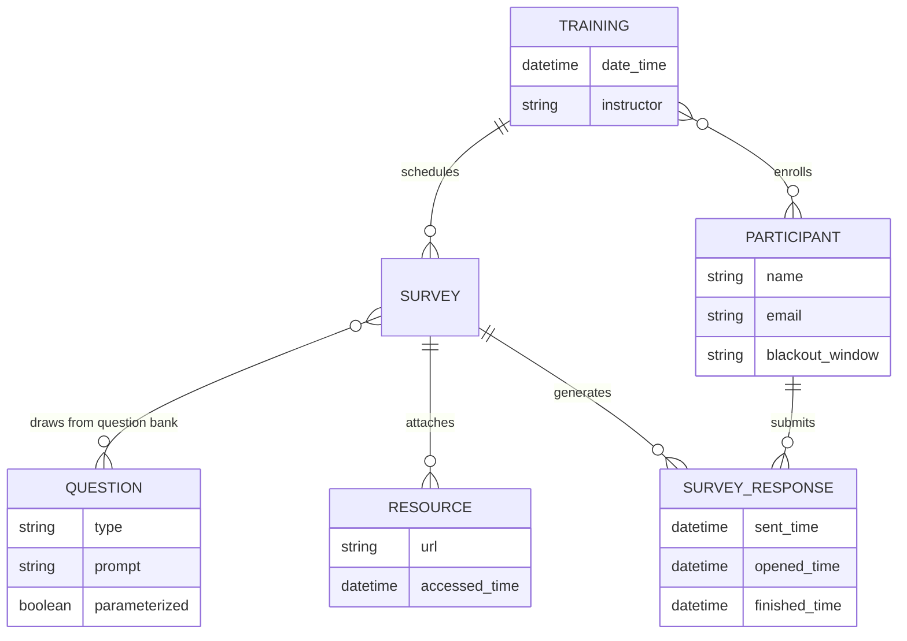
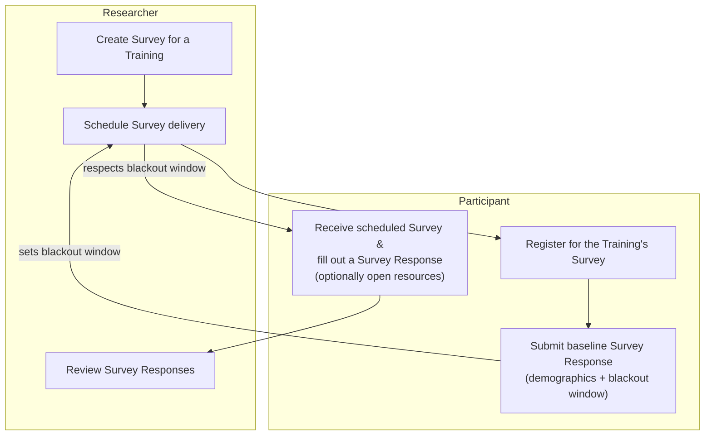

# Pilot Training Research App

A pilot platform for surveying training participants over time — to see whether the surveys themselves help people retain what they learned, and to give trainers and researchers a feedback loop they don't currently have.

## Goals

1. **Prove the platform is feasible** as a way to collect data from participants about trainings and continuous improvement.
   - Survey response-time data (compliance / missingness) informs the feasibility case.
   - A baseline survey and a post-pilot survey collect qualitative data on participant satisfaction.
2. Give trainers feedback on how to improve their trainings, based on participant responses over time.
3. Give the researcher data on how participants apply training content over time, and how that affects their outcomes.
4. Determine whether participating in the survey itself improves participant content retention.

## Personas

| Persona | Wants |
|---|---|
| **Researcher** | To prove methodologies that make training more effective |
| **Participant** | To improve the training programs they take part in |
| **Trainer** | To know how their training is landing, and track improvement over time |

## Use cases

### MVP

**Researcher creates a Survey** · *Researcher*
Multiple surveys for one Training can be authored over time and scheduled ahead of time.

**Researcher schedules Survey delivery** · *Researcher*
Each survey sends on a specific day, outside the participant's blackout window, and may carry its own set of Questions.

**Participant registers for a Training's Survey** · *Researcher, Participant*
The registration link is bound to a Training the Researcher has already set up.

**Participant submits a baseline Survey response** · *Participant*
Captures demographics and the participant's blackout window (when not to send prompts). One baseline applies across all Trainings, and it doubles as input to Goal 1's feasibility analysis.

**Participant fills out a Survey** · *Participant*
Opens the survey, answers its Questions, completes it — and can open linked resources (training materials) from inside the survey.

**Researcher reviews Survey results** · *Researcher*
Reviews aggregated participant responses for a survey.

### Next

- **Participant reviews their own Survey responses.**
- **Trainers get feedback faster** — a Trainer registers, then views survey data and response patterns aggregated across the participants of a Training they conducted.

## Entities

**Training** — date/time · instructor · participants · surveys

**Survey** — 9–10 questions · additional resources (links to training materials)

**Survey Response** — a Participant's fulfilled Survey · sent time · opened time · finished time · answers · resource-accessed time(s)

**Question** — type: Likert, text input, matching?, choice · may be free-floating and assigned to surveys to speed up authoring · may be parameterized (e.g. *"I feel confident using \<skill\>"*)

**Participant** — name · email · blackout window (when notifications should *not* be sent)

## Relationships



## MVP workflow

Baseline collection and delivery scheduling are the same loop: the participant's blackout window, captured once at baseline, constrains every survey the researcher schedules afterward.



## Question — implemented slice

The rest of this Core Domain (Training / Survey / Participant / Survey
Response) isn't built yet. `Question` is the first piece: a researcher can
author a free-floating Question — independent of any Survey — that gets
assigned to Surveys later, once Survey exists. This section documents that
slice to the same standard [`notification-delivery-model.md`](notification-delivery-model.md)
uses, per [`architecture.md`](architecture.md)'s per-context doc template;
the rest of this document stays as the higher-level vision/use-case sketch
for the whole Core Domain.

### Ubiquitous language — Question

| Term | Meaning in this context |
|---|---|
| **Question** (aggregate root) | A prompt plus an author-defined `AnswerFormat`, authored independently of any Survey ("free-floating") so it can be reused across many. Carries no notion of a correct answer — Survey Responses are never scored. |
| **AnswerFormat** | The closed shape of answers a Question accepts: `FreeInput`, `Likert`, or `Choice`. |
| **Likert scale** | An author-configurable, ordered list of scale-point labels (e.g. Strongly Disagree → Strongly Agree) attached to a Likert Question — count and labels are both chosen per Question, not fixed. |
| **Choice options** | An author-configurable list of answer options attached to a Choice Question, plus an `allowMultiple` flag the researcher sets per Question (single-select vs. multi-select). |
| **Parameter** | A named placeholder (`<skill>`) embedded in a Question's `prompt`. A Question may declare zero or more Parameters, one per distinct placeholder; each is bound to a value when the Question is instantiated into a Survey. |

Explicitly rejected terms:

- **Matching** (question type) — present with a "?" in the Entities sketch
  above; dropped for this pass since no concrete use case has specified its
  shape yet. Add it back only when a real matching-question need appears,
  same discipline `notification-delivery-model.md` applies to its own
  rejected terms.
- **Correct answer / score** — Questions and their answers carry no notion
  of correctness; explicitly out of scope per the researcher's brief that
  started this slice.

### Entities & Aggregates — Question

#### `Question` (aggregate root)

- `id`
- `prompt` — may contain zero or more `<name>` parameter placeholders
- `answerFormat` — one of:
  - `FreeInput` — no additional data
  - `Likert` — `scale`: ordered list of point labels (≥ 2), configured per Question
  - `Choice` — `options`: list of option labels (≥ 2, unique), `allowMultiple`: chosen per Question

Behavior:
- `parameterNames` — derived from `prompt` (never stored separately, so
  there's nothing to keep in sync): the ordered, deduplicated list of
  `<name>` tokens found in it.
- `isParameterized` — `parameterNames.length > 0`.
- `renderPrompt(parameterValues)` — substitutes every `<name>` with its
  bound value; throws (`MISSING_PARAMETER_VALUES` / `UNEXPECTED_PARAMETER_VALUES`)
  if the given values don't exactly match the declared parameters. This is
  the behavior the Survey side of "instantiated into a Survey" will call
  once Survey exists — `Question` itself never learns about Survey.

### Target layering — Question

Implemented as TypeScript compiled via `tsc` and run as NestJS (see
[`architecture.md`](architecture.md)), following the same layering
[`notification-delivery-model.md`](notification-delivery-model.md) uses:

```
domain/src/training/          # shared package — see architecture.md's "The domain/ package"
  question.ts               # entity: create/parameterNames/isParameterized/renderPrompt
  answer-format.ts           # value object: FreeInput | Likert | Choice, factory functions validate invariants
  index.ts                   # barrel, exported as 'domain/training'

backend/training/
  application/
    ports.ts                    # QuestionRepository (interface) + its DI token, GENERATE_ID
    errors.ts                   # TrainingError — this context's coded-error shape
    create-question.ts          # CreateQuestion
    get-question.ts             # GetQuestion — 404 (NOT_FOUND) if unknown
    list-questions.ts           # ListQuestions
  infrastructure/
    sqlite-question-repository.ts   # @Injectable(); implements QuestionRepository; owns the questions table
  interface/
    questions.controller.ts         # @Controller('api') — create, list, get; gated by identity's guards
    question-presenter.ts           # pure: domain Question -> wire QuestionView
    training-exception.filter.ts    # @Catch() maps TrainingError.code -> HTTP status
  training.module.ts             # this context's slice of the composition root
```

This also has a frontend-side counterpart — ports, a store, an HTTP gateway,
and a create form/list under `frontend/src/app/training/` — documented in
[`docs/frontend-architecture.md`](frontend-architecture.md) rather than
here, same split `notification-delivery-model.md` uses.

### Relationship to the rest of the Core Domain

Not built yet, and nothing above anticipates its shape beyond what
`renderPrompt` already supports:

- Survey will assign existing Questions to itself (draws from the question
  bank) and, for parameterized Questions, supply the parameter values
  `renderPrompt` needs. That assignment/binding is Survey's concern, not
  Question's — Question's model does not change to accommodate it.
- Question is authored by a Researcher only; gated the same way
  `notifications.controller.ts` gates its Researcher/Trainer-only routes
  (see [`docs/identity-model.md`](identity-model.md)'s "Gating a route").

### Non-goals (for now)

- Survey, Training, Participant, Survey Response, Resource — not modeled
  yet; this slice only builds the free-floating Question entity and its own
  authoring/read flow.
- Assigning a Question to a Survey, and binding its parameter values there —
  deferred until Survey exists.
- Editing/deleting/versioning a Question already in use by a Survey —
  deferred; only creation and read access are in scope now.
- Matching-type Questions (see rejected terms above).
