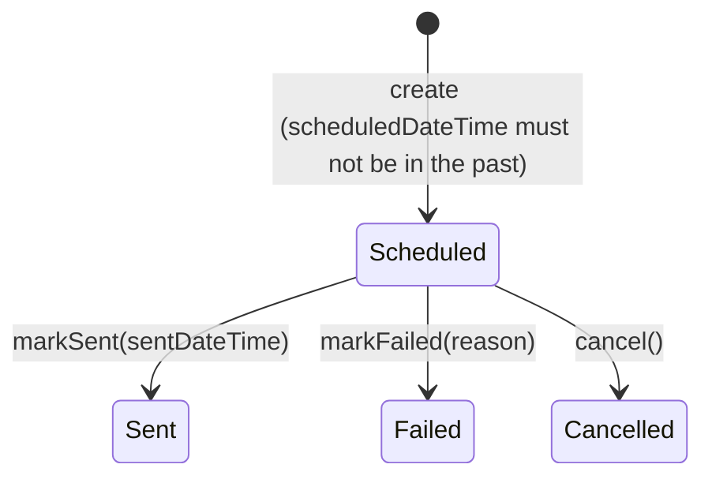

# Notification Delivery — Bounded Context

This document captures the domain model for the push-notification code
(originally a monolithic `server.js` / `store.js`, now `backend/notification-delivery/`
plus a composition-root `backend/main.ts`), scoped deliberately as its own **bounded
context**, separate from the Core Domain described in
[`domain-model.md`](domain-model.md) (Training / Survey / Participant / Question).

## Why this is its own bounded context

Notification Delivery is a **Generic Subdomain**: getting a push message to a
browser is a solved problem, not this project's competitive advantage. It should
stay decoupled from the Core Domain so that:

- The `web-push` library's shapes (`PushSubscription`, `err.statusCode`, etc.)
  never leak past this context's boundary.
- When Training / Survey / Participant are eventually built, that Core Domain
  depends on this context through a narrow interface — it never reaches into
  this context's storage, and this context never learns about Surveys.
- This context's own model stays small enough to reason about on its own.

No Training/Survey/Participant/Question concepts are modeled here. That is
intentional and out of scope for this document.

## Ubiquitous language

| Term | Meaning in this context |
|---|---|
| **Recipient** | Someone who can be sent a notification. Known here only by a username and (optionally) a push subscription — not by their role in the wider system. |
| **Notification** | A message addressed to a Recipient, with a schedule and a delivery outcome. |
| **NotificationStatus** | The closed set of states a Notification's delivery can be in. |

Explicitly rejected terms:

- **`Subscriber`** — considered and dropped. It names the entity after the
  push-subscription *mechanism* rather than its *role* (addressee of a
  notification), and would leave two words in circulation for one concept
  (`recipient` the field vs. `Subscriber` the type). `Recipient` also survives
  a future multi-channel (email/SMS) delivery path without renaming.
- **`RecipientRole`** (Researcher/Trainer/Participant) — considered and
  dropped. Delivery logic doesn't branch on role; it's not part of this
  context's vocabulary. If a future Core Domain integration needs it, that's
  a translation concern at the boundary, not a field here.

## Entities & Aggregates

### `Recipient` (aggregate root)

- `username` — identity
- `pushSubscription` — value object (`endpoint`, keys), nullable until they subscribe

Behavior: `register(username)`, `subscribeToPush(subscription)`,
`clearSubscription()` (invoked when a delivery attempt reports the subscription
is gone).

### `Notification` (aggregate root)

- `title`
- `description`
- `recipient` — reference to a `Recipient` by id (username), not embedded
- `scheduledDateTime`
- `sentDateTime` — null until delivered
- `icon` — optional
- `status` — `NotificationStatus`

Replaces the current code's two parallel structures (`scheduled.json` +
`notifications.json`) with one entity that covers both the scheduled and the
already-sent case.

## `NotificationStatus` state machine

Closed set: `Scheduled | Sent | Failed | Cancelled`.



All three transitions out of `Scheduled` are guarded by the entity itself —
none are legal from `Sent`, `Failed`, or `Cancelled`. This replaces the current
code's unguarded `entry.status = '...'` assignments in `server.js`.

### States considered and demoted

- **`sending`** (from the current code) — not a business-meaningful state.
  It existed only as a concurrency guard so `runDueScheduled` wouldn't
  double-fire a notification across overlapping ticks. Moves to the
  application layer as a claim-before-processing mechanism; it is not part of
  `NotificationStatus`.
- **`expired`** (from the current code) — not a distinct status, just a
  *reason* `Failed` happened. Becomes `markFailed(reason: 'subscription-expired')`.
  Status stays `Failed`; the reason still drives the side effect of calling
  `Recipient.clearSubscription()`, and the admin UI can still show why it failed.

### Claiming due notifications must be atomic

Current `runDueScheduled()` (`server.js:245-272`) claims entries **one at a
time inside its loop** — `entry.status = 'sending'` runs right before each
`await deliverPush(...)`. That only protects the entry already reached; it
doesn't atomically claim the whole due batch upfront. Three triggers call this
function (startup, a 60s `setInterval`, and an external `GET /api/cron/tick`
hit roughly once a minute by GitHub Actions), and they can overlap — so a
second invocation's synchronous filter can still see later entries in the due
list as `Scheduled` and re-send them. This is a live double-send bug, not a
hypothetical one.

Fix: `NotificationRepository` exposes `claimDueNotifications(now): Promise<Notification[]>`,
which — in one synchronous pass, before any `await` — flips every currently-due
`Scheduled` notification to a claimed state and returns exactly that set.
`runDueNotifications` never re-derives the due set with a plain filter; it
only ever iterates what `claimDueNotifications` handed it.

## Target layering

Implemented as TypeScript compiled via `tsc` and run as NestJS (see
[`architecture.md`](../architecture.md) for why the build step exists and
which files are allowed to import `@nestjs/*`):

```
domain/src/notification-delivery/   # shared package — see architecture.md's "The domain/ package"
  recipient.ts               # entity: register/subscribeToPush/clearSubscription
  notification.ts            # entity: schedule/cancel/markSent/markFailed, guards transitions
  notification-status.ts     # value object: Scheduled | Sent | Failed | Cancelled
  index.ts                   # barrel, exported as 'domain/notification-delivery'

backend/notification-delivery/
  application/
    ports.ts                    # RecipientRepository, NotificationRepository, PushGateway
                                 # (interfaces) + their DI Symbol tokens (RECIPIENT_REPOSITORY,
                                 # NOTIFICATION_REPOSITORY, PUSH_GATEWAY, GENERATE_ID)
    errors.ts                   # NotificationDeliveryError — this context's coded-error shape,
                                 # thrown by use cases and (re-)thrown from domain guards, mapped
                                 # to HTTP status by interface/notification-delivery-exception.filter.ts
    register-recipient.ts       # RegisterRecipient — idempotent: create Recipient if username unknown
    subscribe-recipient.ts      # SubscribeRecipient — attach a push subscription to a known Recipient
    resubscribe-recipient.ts    # ResubscribeRecipient — re-key a subscription found by its old endpoint
    list-recipients.ts          # ListRecipients — for the admin dashboard's user picker
    schedule-notification.ts    # ScheduleNotification
    cancel-scheduled-notification.ts   # CancelScheduledNotification
    get-notification.ts         # GetNotification — single-notification read, by id — 404 (NOT_FOUND) if unknown
    deliver-notification.ts     # DeliverNotification — calls PushGateway, reacts to result, calls entity transitions
    run-due-notifications.ts    # RunDueNotifications — claims due Scheduled notifications, delegates to DeliverNotification
    list-notifications.ts       # ListNotifications — filtered read: status != Scheduled, or status == Scheduled
                                 # Each file above exports one plain class with a single
                                 # execute(request) method (the Clean Architecture
                                 # "Interactor" shape) — zero @nestjs/* imports. Constructed
                                 # by notification-delivery.module.ts via useFactory, never
                                 # auto-wired by Nest's decorator scanning.
  infrastructure/
    sqlite-recipient-repository.ts     # @Injectable(); implements RecipientRepository; owns RecipientRecord + the recipients table
    sqlite-notification-repository.ts  # @Injectable(); implements NotificationRepository; owns NotificationRecord + the notifications table
    web-push-gateway.ts               # @Injectable(); implements PushGateway — only file importing 'web-push';
                                       # injects Nest's ConfigService for the VAPID_* env vars,
                                       # calls webpush.setVapidDetails from onModuleInit()
  interface/
    recipients.controller.ts     # @Controller('api') — vapid-public-key, register, subscribe,
                                  # resubscribe, users
    notifications.controller.ts  # @Controller('api') — send, notifications, notifications/:id,
                                  # schedule, scheduled, scheduled/:id, cron/tick
    notification-scheduler.ts    # @Injectable() NotificationScheduler — OnApplicationBootstrap
                                  # runs a startup catch-up sweep, @Interval(60_000) repeats it;
                                  # this context's non-HTTP "interface adapter" (delivery
                                  # mechanism = the clock) for run-due-notifications.ts
    notification-presenter.ts    # pure: domain Notification -> wire NotificationView, deliver
                                  # result -> HTTP outcome (unchanged by the Nest conversion —
                                  # was already framework-free)
    notification-delivery-exception.filter.ts   # @Catch() ExceptionFilter, scoped to this
                                  # context's controllers via @UseFilters() (not global) —
                                  # error-code -> HTTP-status mapping, imports
                                  # NotificationDeliveryError from application/errors.ts rather
                                  # than owning the type — it doesn't originate the error, only
                                  # translates its .code to an HTTP status
  notification-delivery.module.ts  # this context's slice of the composition root: a Nest
                                    # @Module whose providers array wires infrastructure
                                    # adapters (useClass) and use-case classes (useFactory,
                                    # each keyed by the class itself as its own DI token) into
                                    # the controllers/scheduler above
```

`backend/infrastructure/sqlite.ts` is this context's persistence layer's **generic
technical infrastructure** module (see [`architecture.md`](../architecture.md))
— not part of this or any bounded context: it owns one shared `DatabaseSync`
connection to `DATA_DIR/app.db` (the Fly volume already mounted for this app),
and declares no type for `Recipient`, `Notification`, or any other entity.
Those record/DTO shapes, table schemas, and `CREATE TABLE` statements are
owned by this context's own `infrastructure/` files above, which are the only
callers of `sqlite.ts` (via the `#sqlite` import alias), calling `getDb()`
directly in their constructors rather than receiving it through Nest's DI —
an existing design predating the Nest conversion, left as-is.

`backend/main.ts` + `backend/app.module.ts` (composition root, shared by every
context) + `notification-delivery.module.ts` (this context's slice) are
wiring only: construct infrastructure adapters, inject into application use
cases, mount the two controllers above, listen.

`ports.ts` lives in `application/`, not `domain/` — per [`architecture.md`](../architecture.md),
a repository/gateway interface is shaped by what this application needs to
persist or deliver, not an Enterprise Business Rule the entities would carry
regardless of the software. Its DI tokens are colocated there too, since a
`Symbol` naming an interface has no runtime existence otherwise and is the
natural companion to the interface it identifies — this is a plain value, not
a framework import, so it doesn't compromise `application/`'s framework-free
rule.

This context also has a frontend-side counterpart — ports, the
`EnablePushNotifications`/`AdminNotificationsStore` orchestrators, HTTP/browser-push
gateway adapters, and the send/schedule/history/detail components under
`frontend/src/app/notification-delivery/` — documented in
[`docs/frontend-architecture.md`](frontend-architecture.md) rather than here,
since this document covers Notification Delivery's backend model/layering
only.

## Use case boundaries (Request/Response shapes)

Plain objects only — nothing Express-shaped (`req`/`res`) crosses into
`application/`. This mirrors what `server.js` already does today: every route
handler destructures `req.body` into plain fields before calling `deliverPush`.

- **`scheduleNotification(request)`**
  `{ recipientId, title, description, scheduledDateTime, icon? }` →
  `{ notificationId }`. Loads the `Recipient` (404 if unknown — an
  application-layer check, not a domain guard), constructs a `Notification`
  (entity guards `scheduledDateTime`), saves it.

- **`cancelScheduledNotification(request)`**
  `{ notificationId }` → `void`. Loads the `Notification`, calls `.cancel()`
  (entity rejects if not currently `Scheduled`), saves.

- **`getNotification(request)`**
  `{ notificationId }` → `Notification`. Loads by id, 404s (`NOT_FOUND`) if
  unknown. No status filter, unlike `listNotifications` — any notification
  regardless of state can be read directly by id. Exposed as
  `GET /api/notifications/:id`, and is what `public/client/notification.html`
  fetches to render a single notification's detail page (see "Notification
  click lands on its own detail page" below).

- **`deliverNotification(request)`**
  `{ notificationId }` → `{ status: 'Sent' | 'Failed', reason? }`. Loads the
  `Notification` + its `Recipient`, calls `PushGateway.send(...)`, reacts:
  - success → `notification.markSent(now)`, save.
  - subscription gone (gateway maps `410`/`404` to a `subscription-expired`
    result) → `recipient.clearSubscription()` + `notification.markFailed('subscription-expired')`,
    save both.
  - any other failure → `notification.markFailed(reason)`, save.

- **`runDueNotifications()`**
  no input → `{ checked, sent }`. Calls `NotificationRepository.claimDueNotifications(now)`
  (see below), then calls `deliverNotification` for each claimed notification.

### Immediate send vs. scheduled send

The state machine as first drafted required `scheduledDateTime` **strictly in
the future**, matching `POST /api/schedule` — but current `server.js:177-184`
also has `POST /api/send`, which delivers right now with no persisted
schedule at all. That's a real behavior the model has to account for, not a
gap to leave implicit.

Resolution: relax the entity guard to `scheduledDateTime` **not in the past**
(`>= now`), so "send now" is modeled as "schedule for now," not as a separate
creation path. `interface/http-routes.ts`'s `/api/send` controller then calls
`scheduleNotification({ ..., scheduledDateTime: new Date() })` immediately
followed by `deliverNotification({ notificationId })` in the same request —
synchronously, same as today's route — rather than waiting for the next
`runDueNotifications` tick. One creation path, one delivery path, no special
case in the domain layer for "immediate."

### One repository, two admin views

`public/admin/app.js` calls `GET /api/notifications` (sent/failed history) and
`GET /api/scheduled` (pending list) as two separate endpoints today, backed by
two separate files (`notifications.json` + `scheduled.json`). The single
`Notification` entity replaces both files, but the admin UI keeps its two
endpoints — no frontend change needed. `interface/http-routes.ts` implements
both as filtered reads over the one `NotificationRepository`:

- `GET /api/notifications` → notifications where `status != Scheduled`
- `GET /api/scheduled` → notifications where `status == Scheduled`

If the admin UI ever needs a combined view, that's a new endpoint added
later — not a reason to collapse these two now.

### Notification click lands on its own detail page

`deliverNotification` puts `data: { notificationId: notification.id }` on the
push payload (alongside `title`/`body`/`icon`), so the browser's service
worker (`public/client/sw.js`, outside this bounded context — see
`architecture.md`'s note on browser-side code) receives the id in
`event.notification.data` and, on `notificationclick`, navigates the client
to `/notification.html?id=<id>` instead of unconditionally focusing/opening
the root page. That page is a plain fetch against `GET /api/notifications/:id`
(`getNotification`, above) — no new backend concept, just a consumer of the
existing read use case.

## Relationship to the future Core Domain

Not built yet, and nothing above should anticipate its shape. When
Training/Survey/Participant exist:

- The Core Domain will provision `Recipient`s into this context (e.g.
  "register this Participant as a notification recipient") and call
  `scheduleNotification({ recipientId, title, description, scheduledDateTime })`.
- Any translation from a Core Domain concept (e.g. `Participant`) to this
  context's `Recipient` happens on the **Core Domain's side** of the boundary —
  this context's model does not change to accommodate it.
- This context never learns about Surveys, Trainings, or why a notification
  was scheduled — that context (e.g. "this fulfills Survey X") is owned and
  kept entirely by the caller.

The `identity` bounded context now fulfills the "provisions Recipients"
integration point anticipated above: `RegisterUser`
(`backend/identity/application/register-user.ts`) calls
`RegisterRecipient.execute({ username: user.id })` directly as a plain
constructor dependency whenever a new account is created. Separately,
`SessionAuthGuard`/`RolesGuard` from `identity/interface/` are now used by
this context's own controllers (`recipients.controller.ts`,
`notifications.controller.ts`) to gate routes — the one sanctioned
cross-context interface import in this codebase, since authentication is a
cross-cutting concern rather than a business capability of this context. See
[`docs/identity-model.md`](identity-model.md) for the full picture. This
context's own model (`Recipient`/`Notification`, no role field) is
unchanged.

## Non-goals (for now)

- No `role` field or `RecipientRole` value object.
- No `surveyId` / `purpose` field on `Notification`.
