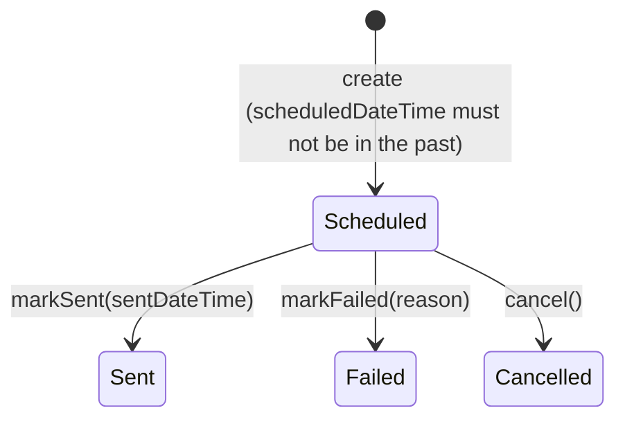

# Notification Delivery — Bounded Context

This document captures the domain model for the push-notification code
(originally a monolithic `server.js` / `store.js`, now `src/notification-delivery/`
plus a composition-root `server.ts`), scoped deliberately as its own **bounded
context**, separate from the Core Domain described in
[`domain-model.md`](domain-model.md) (Training / Survey / Participant / Question).

## Why this is its own bounded context

Notification Delivery is a **Generic Subdomain**: getting a push message to a
browser is a solved problem, not this project's competitive advantage. It should
stay decoupled from the Core Domain so that:

- The `web-push` library's shapes (`PushSubscription`, `err.statusCode`, etc.)
  never leak past this context's boundary.
- When Training / Survey / Participant are eventually built, that Core Domain
  depends on this context through a narrow interface — it never reaches into
  this context's storage, and this context never learns about Surveys.
- This context's own model stays small enough to reason about on its own.

No Training/Survey/Participant/Question concepts are modeled here. That is
intentional and out of scope for this document.

## Ubiquitous language

| Term | Meaning in this context |
|---|---|
| **Recipient** | Someone who can be sent a notification. Known here only by a username and (optionally) a push subscription — not by their role in the wider system. |
| **Notification** | A message addressed to a Recipient, with a schedule and a delivery outcome. |
| **NotificationStatus** | The closed set of states a Notification's delivery can be in. |

Explicitly rejected terms:

- **`Subscriber`** — considered and dropped. It names the entity after the
  push-subscription *mechanism* rather than its *role* (addressee of a
  notification), and would leave two words in circulation for one concept
  (`recipient` the field vs. `Subscriber` the type). `Recipient` also survives
  a future multi-channel (email/SMS) delivery path without renaming.
- **`RecipientRole`** (Researcher/Trainer/Participant) — considered and
  dropped. Delivery logic doesn't branch on role; it's not part of this
  context's vocabulary. If a future Core Domain integration needs it, that's
  a translation concern at the boundary, not a field here.

## Entities & Aggregates

### `Recipient` (aggregate root)

- `username` — identity
- `pushSubscription` — value object (`endpoint`, keys), nullable until they subscribe

Behavior: `register(username)`, `subscribeToPush(subscription)`,
`clearSubscription()` (invoked when a delivery attempt reports the subscription
is gone).

### `Notification` (aggregate root)

- `title`
- `description`
- `recipient` — reference to a `Recipient` by id (username), not embedded
- `scheduledDateTime`
- `sentDateTime` — null until delivered
- `icon` — optional
- `status` — `NotificationStatus`

Replaces the current code's two parallel structures (`scheduled.json` +
`notifications.json`) with one entity that covers both the scheduled and the
already-sent case.

## `NotificationStatus` state machine

Closed set: `Scheduled | Sent | Failed | Cancelled`.



All three transitions out of `Scheduled` are guarded by the entity itself —
none are legal from `Sent`, `Failed`, or `Cancelled`. This replaces the current
code's unguarded `entry.status = '...'` assignments in `server.js`.

### States considered and demoted

- **`sending`** (from the current code) — not a business-meaningful state.
  It existed only as a concurrency guard so `runDueScheduled` wouldn't
  double-fire a notification across overlapping ticks. Moves to the
  application layer as a claim-before-processing mechanism; it is not part of
  `NotificationStatus`.
- **`expired`** (from the current code) — not a distinct status, just a
  *reason* `Failed` happened. Becomes `markFailed(reason: 'subscription-expired')`.
  Status stays `Failed`; the reason still drives the side effect of calling
  `Recipient.clearSubscription()`, and the admin UI can still show why it failed.

### Claiming due notifications must be atomic

Current `runDueScheduled()` (`server.js:245-272`) claims entries **one at a
time inside its loop** — `entry.status = 'sending'` runs right before each
`await deliverPush(...)`. That only protects the entry already reached; it
doesn't atomically claim the whole due batch upfront. Three triggers call this
function (startup, a 60s `setInterval`, and an external `GET /api/cron/tick`
hit roughly once a minute by GitHub Actions), and they can overlap — so a
second invocation's synchronous filter can still see later entries in the due
list as `Scheduled` and re-send them. This is a live double-send bug, not a
hypothetical one.

Fix: `NotificationRepository` exposes `claimDueNotifications(now): Promise<Notification[]>`,
which — in one synchronous pass, before any `await` — flips every currently-due
`Scheduled` notification to a claimed state and returns exactly that set.
`runDueNotifications` never re-derives the due set with a plain filter; it
only ever iterates what `claimDueNotifications` handed it.

## Target layering

Implemented, as TypeScript run directly via `node --experimental-strip-types`
(see [`architecture.md`](../architecture.md) — no build step, no `tsconfig.json`):

```
src/notification-delivery/
  domain/
    recipient.ts               # entity: register/subscribeToPush/clearSubscription
    notification.ts            # entity: schedule/cancel/markSent/markFailed, guards transitions
    notification-status.ts     # value object: Scheduled | Sent | Failed | Cancelled
  application/
    ports.ts                    # RecipientRepository, NotificationRepository, PushGateway (interfaces)
    register-recipient.ts       # idempotent: create Recipient if username unknown
    subscribe-recipient.ts      # attach a push subscription to a known Recipient
    resubscribe-recipient.ts    # re-key a subscription found by its old endpoint
    list-recipients.ts          # for the admin dashboard's user picker
    schedule-notification.ts
    cancel-scheduled-notification.ts
    deliver-notification.ts     # calls PushGateway, reacts to result, calls entity transitions
    run-due-notifications.ts    # claims due Scheduled notifications, delegates to deliver-notification
    list-notifications.ts       # filtered read: status != Scheduled, or status == Scheduled
  infrastructure/
    json-recipient-repository.ts     # implements RecipientRepository; owns RecipientRecord + recipients.json
    json-notification-repository.ts  # implements NotificationRepository; owns NotificationRecord + notification-records.json
    migrate-legacy-notification-files.ts  # owns LegacyNotificationEntry/LegacyScheduledEntry (pre-refactor shapes)
    web-push-gateway.ts               # implements PushGateway — only file importing 'web-push'
  interface/
    http-routes.ts              # Express routes — thin controllers calling application/ use cases
```

`src/infrastructure/store.ts` is a **generic technical infrastructure** module
(see [`architecture.md`](../architecture.md)) — not part of this or any
bounded context: it knows how to atomically read/write a JSON file or a `Map`
serialized as one, and nothing else. It declares no type for `Recipient`,
`Notification`, or any other entity — those record/DTO shapes, and the
specific filenames they're persisted under, are owned by this context's own
`infrastructure/` files above, which are the only callers of `store.ts` (via
the `#store` import alias).

`server.ts` is wiring only: construct infrastructure adapters, inject into
application use cases, mount `interface/http-routes.ts`, listen.

`ports.ts` lives in `application/`, not `domain/` — per [`architecture.md`](../architecture.md),
a repository/gateway interface is shaped by what this application needs to
persist or deliver, not an Enterprise Business Rule the entities would carry
regardless of the software.

## Use case boundaries (Request/Response shapes)

Plain objects only — nothing Express-shaped (`req`/`res`) crosses into
`application/`. This mirrors what `server.js` already does today: every route
handler destructures `req.body` into plain fields before calling `deliverPush`.

- **`scheduleNotification(request)`**
  `{ recipientId, title, description, scheduledDateTime, icon? }` →
  `{ notificationId }`. Loads the `Recipient` (404 if unknown — an
  application-layer check, not a domain guard), constructs a `Notification`
  (entity guards `scheduledDateTime`), saves it.

- **`cancelScheduledNotification(request)`**
  `{ notificationId }` → `void`. Loads the `Notification`, calls `.cancel()`
  (entity rejects if not currently `Scheduled`), saves.

- **`deliverNotification(request)`**
  `{ notificationId }` → `{ status: 'Sent' | 'Failed', reason? }`. Loads the
  `Notification` + its `Recipient`, calls `PushGateway.send(...)`, reacts:
  - success → `notification.markSent(now)`, save.
  - subscription gone (gateway maps `410`/`404` to a `subscription-expired`
    result) → `recipient.clearSubscription()` + `notification.markFailed('subscription-expired')`,
    save both.
  - any other failure → `notification.markFailed(reason)`, save.

- **`runDueNotifications()`**
  no input → `{ checked, sent }`. Calls `NotificationRepository.claimDueNotifications(now)`
  (see below), then calls `deliverNotification` for each claimed notification.

### Immediate send vs. scheduled send

The state machine as first drafted required `scheduledDateTime` **strictly in
the future**, matching `POST /api/schedule` — but current `server.js:177-184`
also has `POST /api/send`, which delivers right now with no persisted
schedule at all. That's a real behavior the model has to account for, not a
gap to leave implicit.

Resolution: relax the entity guard to `scheduledDateTime` **not in the past**
(`>= now`), so "send now" is modeled as "schedule for now," not as a separate
creation path. `interface/http-routes.ts`'s `/api/send` controller then calls
`scheduleNotification({ ..., scheduledDateTime: new Date() })` immediately
followed by `deliverNotification({ notificationId })` in the same request —
synchronously, same as today's route — rather than waiting for the next
`runDueNotifications` tick. One creation path, one delivery path, no special
case in the domain layer for "immediate."

### One repository, two admin views

`public/admin/app.js` calls `GET /api/notifications` (sent/failed history) and
`GET /api/scheduled` (pending list) as two separate endpoints today, backed by
two separate files (`notifications.json` + `scheduled.json`). The single
`Notification` entity replaces both files, but the admin UI keeps its two
endpoints — no frontend change needed. `interface/http-routes.ts` implements
both as filtered reads over the one `NotificationRepository`:

- `GET /api/notifications` → notifications where `status != Scheduled`
- `GET /api/scheduled` → notifications where `status == Scheduled`

If the admin UI ever needs a combined view, that's a new endpoint added
later — not a reason to collapse these two now.

## Relationship to the future Core Domain

Not built yet, and nothing above should anticipate its shape. When
Training/Survey/Participant exist:

- The Core Domain will provision `Recipient`s into this context (e.g.
  "register this Participant as a notification recipient") and call
  `scheduleNotification({ recipientId, title, description, scheduledDateTime })`.
- Any translation from a Core Domain concept (e.g. `Participant`) to this
  context's `Recipient` happens on the **Core Domain's side** of the boundary —
  this context's model does not change to accommodate it.
- This context never learns about Surveys, Trainings, or why a notification
  was scheduled — that context (e.g. "this fulfills Survey X") is owned and
  kept entirely by the caller.

## Non-goals (for now)

- No `role` field or `RecipientRole` value object.
- No `surveyId` / `purpose` field on `Notification`.
